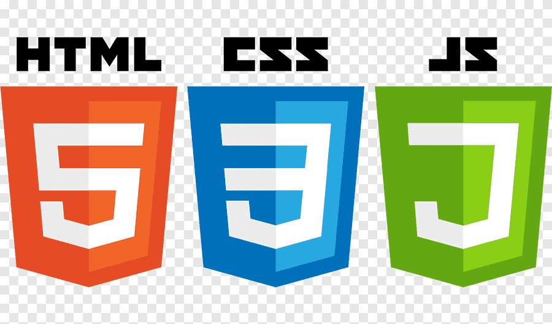

<h1 align="center">Hello World! 👋</h1>
<h1 align="center">I'm Daniel Escobar, "Tiger" to my friends 🐯</h1> 
<h2 align="center">Programming student, from El Salvador 😎</h2>

 

   

- 🌱 I’m currently learning: Web, Mobile and Database technologies
- 📫 How to reach me: 00138218@uca.edu.sv | escobare361@gmail.com
- ⚡ Fun fact: The eyes exercise more than the legs 👀 

<h2 align="center">Technologies that I use</h2>

                     

 

                

